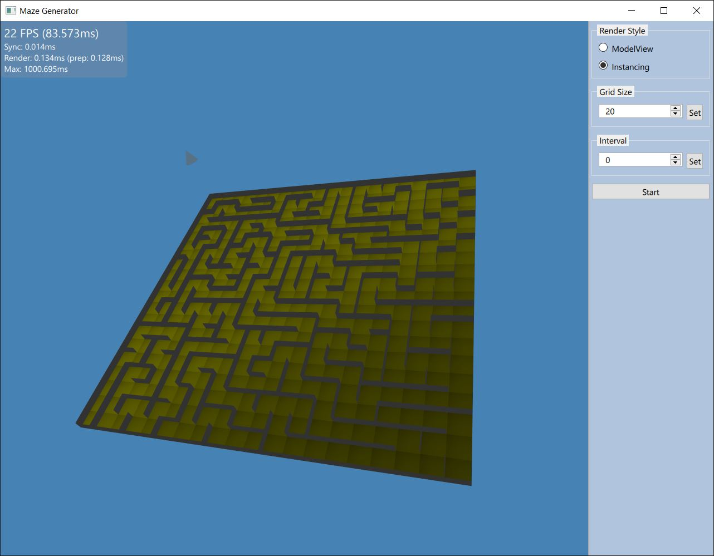

# Maze Generator 

An example C++ code to execute the depth-first search algorithm with recursive backtracking.

Inspired by this [Youtube video](https://www.youtube.com/watch?v=HyK_Q5rrcr4) by [The Coding Train](https://www.youtube.com/@TheCodingTrain)

## Dependencies
* Qt 6

## Features

* 3D Maze rendering with QtQuick3D
* ModelView Rendering with QAbstractItemModel and Repeater3D
* Instanced Rendering with QQuick3DInstancing

## Screenshot

